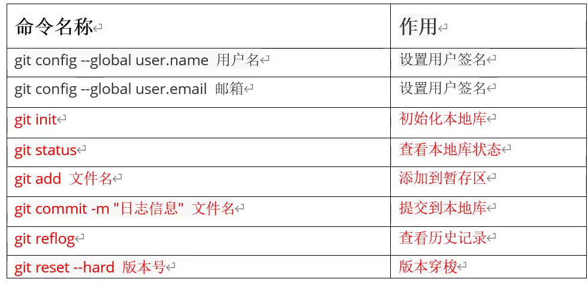
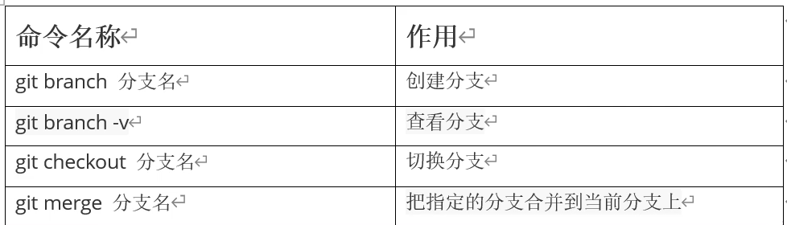

# 基本流程

# 常用命令



git log 为查看详细信息

git config --global user.name TaoChu

git config --global user.email 2399025099@qq.com

# 分支



# GIT进阶

1、关联远程仓库 / 给远程仓库起别名

```bash
git remote add xxx(别名) xxxxxxx(远程仓库地址)

git remote -v 查看已经关联的远程仓库
```
 关联远程仓库之后推送本地分支时就可以用 “别名” 来替代冗长的远程仓库地址（简化GIT入门第6步）

例：git push origin xxxx(当前本地分支) 

2、删除已关联远程仓库 / 删除远程仓库别名
```bash
git remote remove xxx(远程仓库别名) 删除已关联的远程仓库
```
3、拉取远程分支并合并当前分支
```bash
 git pull <远程仓库地址> <远程分支名称>
```
​    一般在 git push 推送 之前需要先 git pull 一下，确保分支为当前最新的代码

4、分支操作

```bash
git branch                  查看分支

git branch -a               查看远程和本地所有分支

git branch xxx              创建xxx分支（内容与当前分支保持一致）

git checkout xxx(分支名)     切换至xxx分支

git checkout -b xxx(分支名)  创建并切换至xxx分支

git branch -d xxx(分支名)    删除xxx分支
```
一般我们都需要创建自己的分支，在自己的分支进行修改，最后再合并到master分支上

禁止在master分支上直接进行开发工作
    
分支修改内容完成或者未完成，此时如果需要切换分支
    
切换分支之前要把内容都提交到该分支上，这样能保证工作区的干净
    
也不影响新的分支，切换回来后还能继续该分支的修改工作

5、合并分支
```bash
git merge xxx(需要合并到当前分支上的其他分支名)
```
该命令可以将 xxx  分支合并至 当前分支，所以合并前请先确定当前分支是否正确

6、取消合并

注意： 合并代码没有add时可使用该命令取消merge，如果代码已经add，则需要先回退操作之后再取消merge
```bash
git merge --abort
```
7、丢弃工作区内容

注意： 该操作会删除掉所有本地工作区修改的所有内容并回到未修改前的状态，请确保自己是否需要该操作
```bash
git checkout -f  丢弃工作区内容
```

# IDE集成工具

使用ide集成工具要有git配置文件 用于忽略 和源码不相关的文件

.gitignore